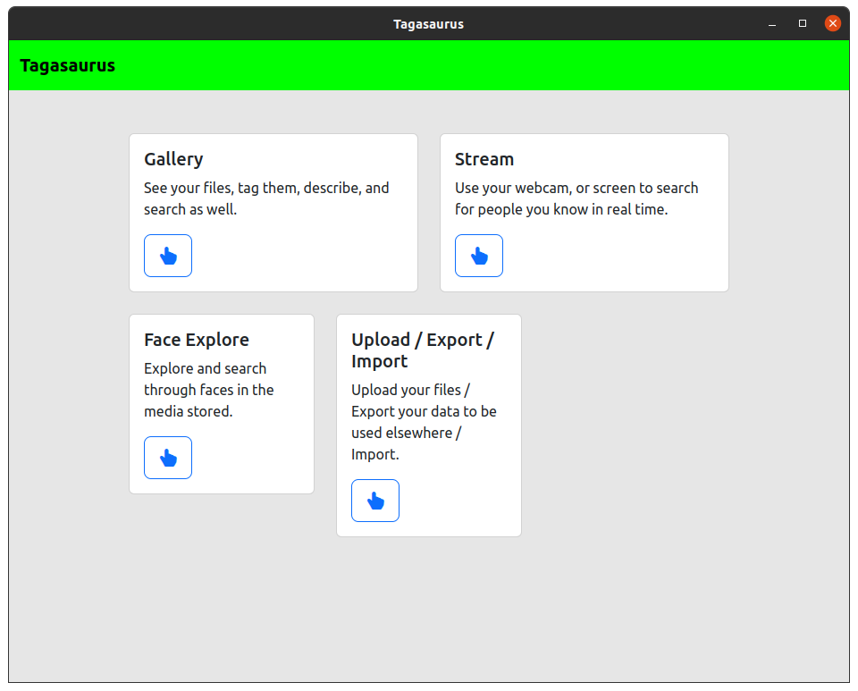
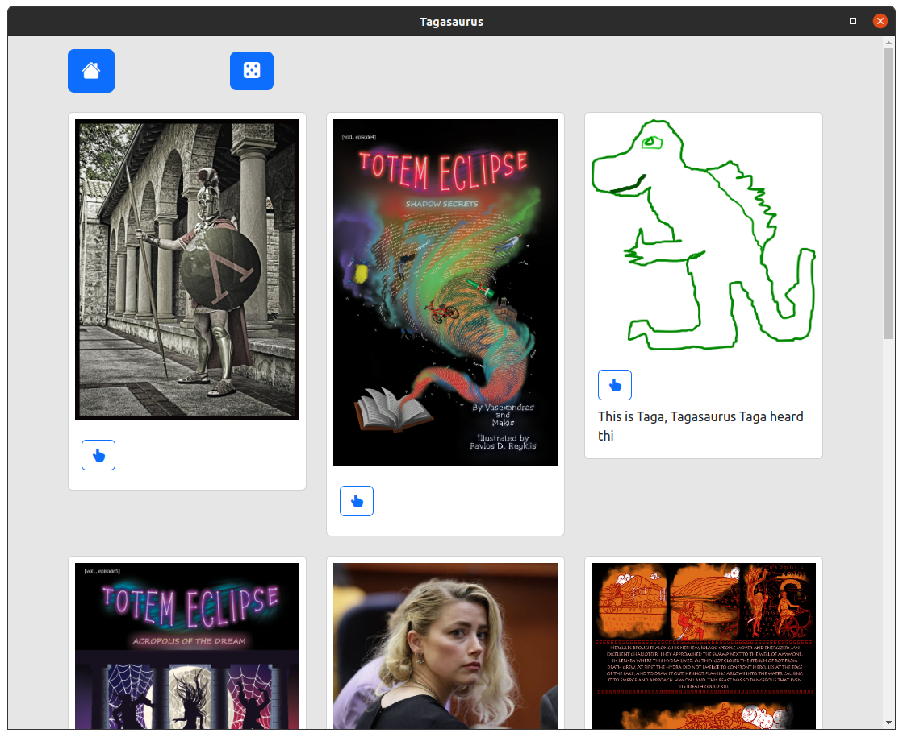
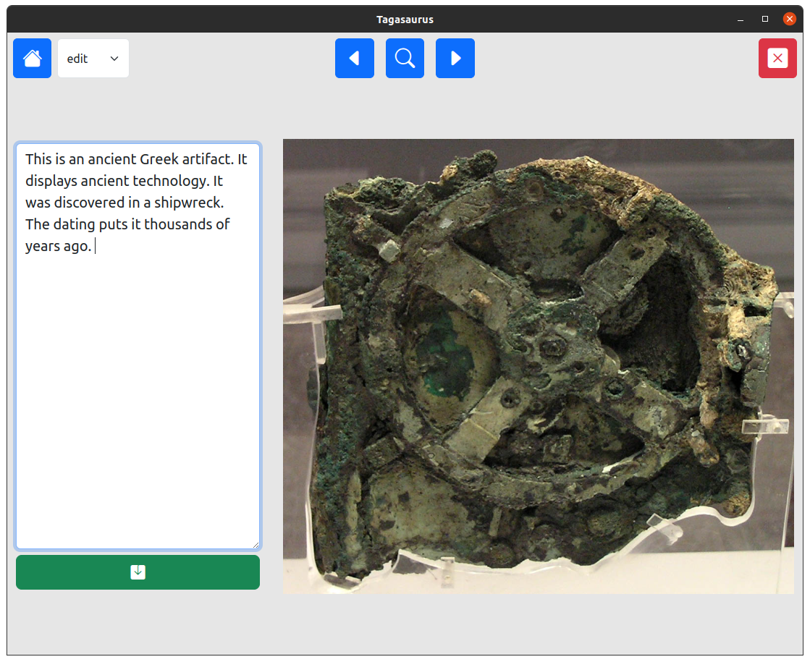
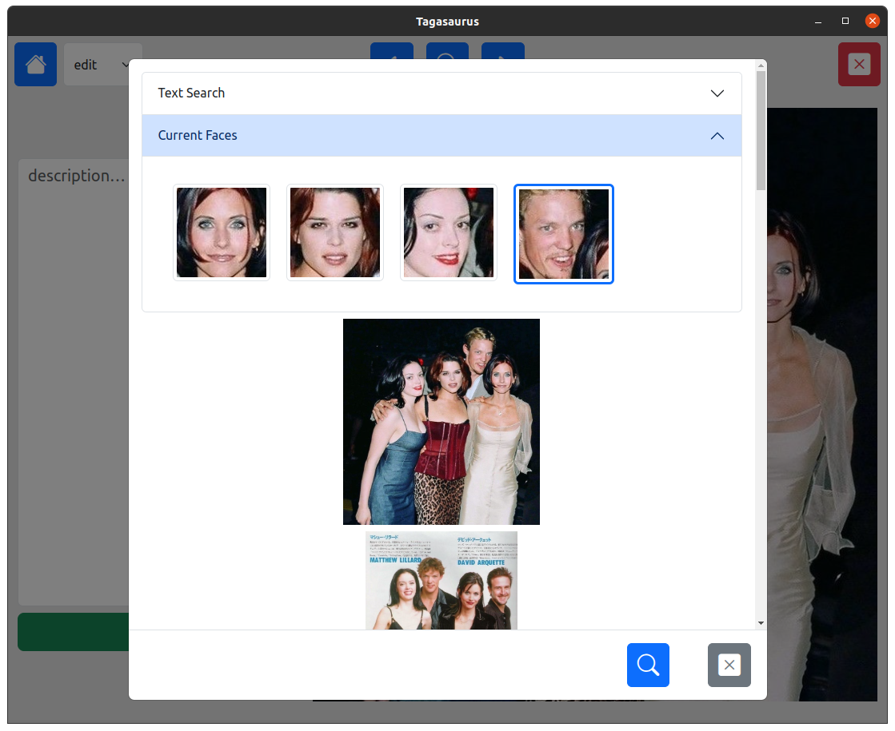
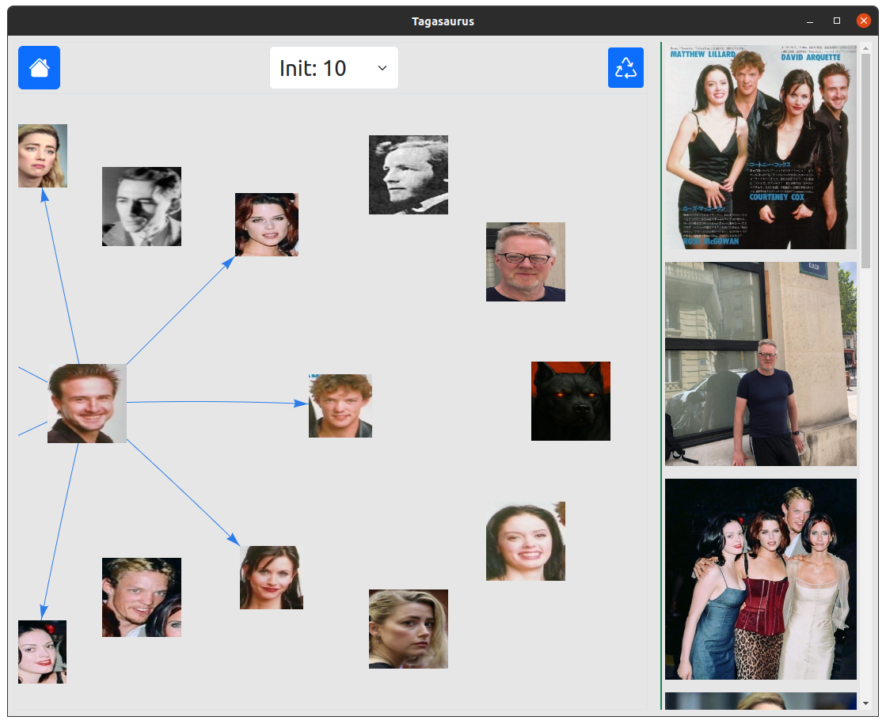
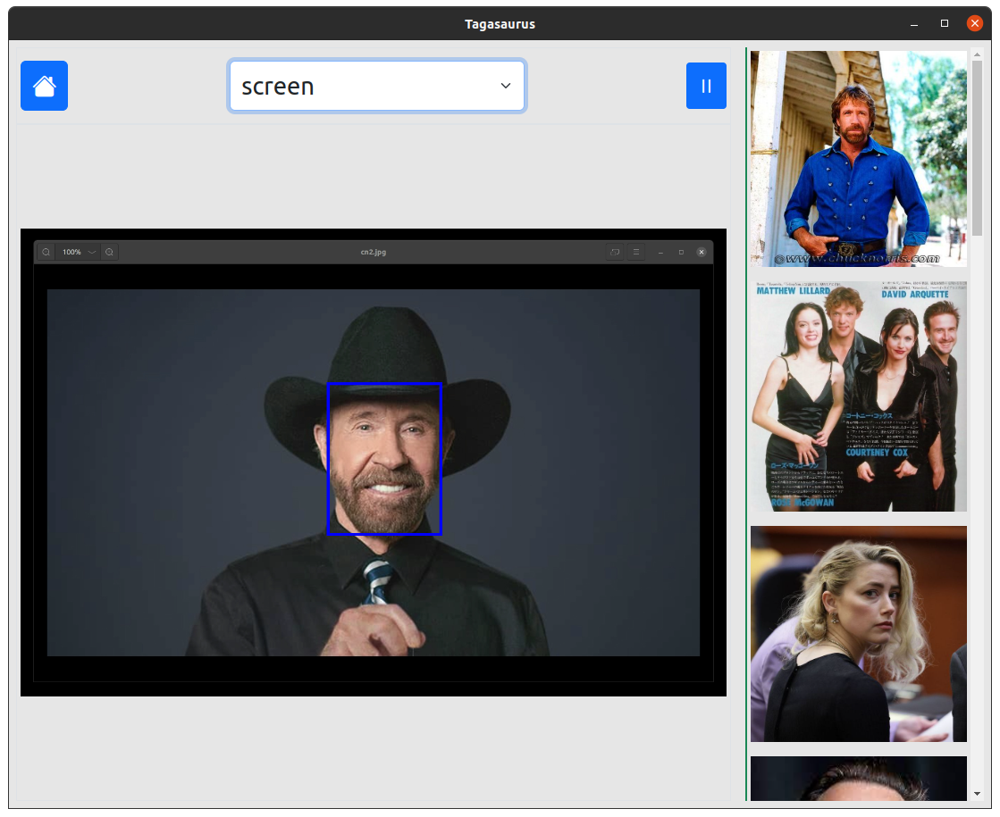

# Tagasaurus
Tag Your Planet

## Overview  
Tagasaurus is an **offline-first desktop app** that keeps your photos, PDFs, videos, GIFs, and audio **local on your own disk**. Local machine-learning lets you locate files simply, or drop in a face and find every shot of that person instantly.

## Key Features  
- **ML-powered visual search** - match a face by example (webcam, screen-share, or any image).  
- **Natural text queries** - 'sunset beach 2022' pulls the similar memories you want.  
- **Import / export** - save, share, or migrate your entire library as a single archive. Simply drag and drop images onto the app to store them. Import data later to merge the storage.
- **Cross-platform** - binaries for both **Linux** and **Windows**; no cloud, no sign-ups.
- **People-network** - navigate the people from your photos using an intuitive point and click tool.

## Download  

- [Linux download](https://github.com/mantzaris/Tagasaurus/releases/download/v0.0.1/tagasaurus-0.0.1.zip), *sha256:21d57ab334976b80d8eac1b92b512db7a24a63b9e09ccd62492c26e63df25777*, a zip holding the executable which needs to be given executable permissions via chmod +x ./tagasaurus before running at the command line. 

- [Windows download](https://github.com/mantzaris/Tagasaurus/releases/download/v0.0.1/Tagasaurus-0.0.1-win.zip),  *sha256:6c2ab8ea6935c30ca3fefedd81fa01c796f8a192345e83f1b727ae2728548a7a*, a zip holding the executable, open it and run as administrator, or simply from git bash via ./Tagasaurus.exe

## Screenshots  

  
   
  
   
  
  

# alternative
If your computer is not powerful enough to run the machine learning for this app there is the original, 'legacy' Tagasaurus, https://github.com/mantzaris/TagasaurusLegacy which is also very powerfull with more features for those wishing to provide more focus on storing and sorting **memes**.

<!-- ## Development -->
<!-- in dev also import 'env' and do, 'env.useBrowserCache = false;' -->
<!-- sudo apt install git-lfs; git lfs install; git lfs pull; -->